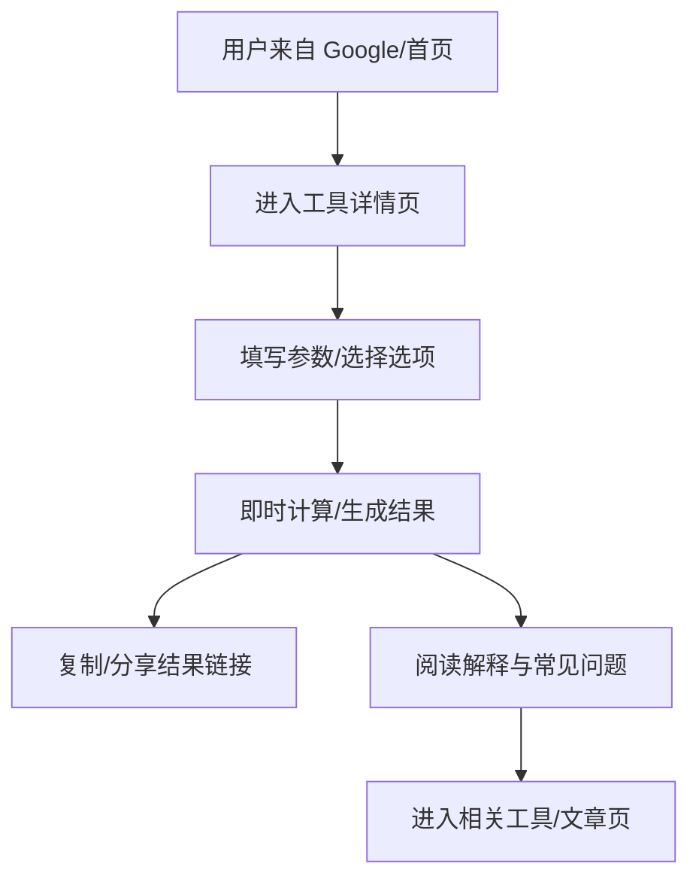

## 1. 产品概述
打造一个无需登录、打开即用的多功能小工具网站，覆盖高需求、可搜索、可变现的工具（计算器、单词类小游戏、轻量转换类工具等），通过程序化 SEO + 广告联盟实现长期自然流量与收益。
- 目标用户：面向全球（重点美国）需要“快速算一下/生成一下/转换一下”的普通用户、学生、理财用户、内容从业者
- 产品价值：低门槛使用 + 明确搜索意图承接 + 工具页可规模化扩展 + 广告变现闭环

## 2. 核心功能

### 2.1 用户角色
本产品不区分角色、无需注册登录。

### 2.2 功能模块（页面级）
1. **首页**：产品定位、热门工具入口、分类导航、搜索、SEO 入口区块
2. **工具列表页**：按分类浏览、关键词搜索、排序（热门/新增/高 CPM 优先）
3. **工具详情页（统一模板）**：工具交互区、结果区、解释说明、常见问题、相关工具推荐、广告位
4. **专题/文章页（SEO 内容库）**：围绕高意图关键词输出解释/对比/指南，导流到工具
5. **关于/反馈页**：简单反馈表单（可选：mailto）、免责声明/隐私政策/广告说明

### 2.3 首批工具范围（MVP）
优先上线“无需后端/可纯前端实现/需求稳定/美国地区金融类 CPM/CPC 通常更高”的工具组合。
- **房贷计算器（Mortgage Calculator）**：等额本息/等额本金、摊还表、总利息、可视化曲线
- **贷款计算器（Loan Calculator）**：通用贷款（月供/利息/年化），可对比多方案
- **复利计算器（Compound Interest Calculator）**：定投/利率/周期/通胀调整（可选）
- **单词接龙（Word Chain Game）**：英文单词接龙、基础校验、计分与难度
- **单词生成器（Word Generator）**：按长度/首尾字母/包含字符生成；支持“可用作 Wordle 练习”

说明：文件格式转换、图片去水印等功能更容易涉及后端算力、依赖库、合规边界（尤其去水印），建议作为第二阶段扩展：先做“可合法可解释的图片处理”（压缩、裁剪、转 WebP、去背景等）与“轻量文本/编码转换”。

### 2.4 页面明细
| 页面名称 | 模块名称 | 功能描述 |
|---|---|---|
| 首页 | 顶部导航 | Logo、分类入口、站内搜索、语言切换（预留） |
| 首页 | 热门工具区 | 6–12 个卡片，突出金融/计算器类 |
| 首页 | SEO 内容入口 | “常见问题/指南”卡片，导向文章页 |
| 工具列表页 | 分类筛选 | 计算器/英语/图片/文件/文本等 |
| 工具列表页 | 搜索与排序 | 关键词搜索、热门/新增/收益优先排序 |
| 工具详情页 | 工具输入区 | 表单输入、校验、默认值、一键重置 |
| 工具详情页 | 结果展示区 | 大号数字、辅助说明、复制/分享链接 |
| 工具详情页 | 解释说明 | 公式解释、变量含义、示例、FAQ（可折叠） |
| 工具详情页 | 相关工具推荐 | 同类/上下游工具卡片 |
| 工具详情页 | 广告位 | 顶部横幅、结果下方、侧栏（桌面端） |
| 文章页 | 结构化内容 | 标题、目录、正文、FAQ、导向工具 CTA |
| 关于/反馈页 | 合规信息 | 隐私政策、免责声明、广告说明、反馈入口 |

## 3. 核心流程
用户从搜索引擎或首页进入某个工具页，填写参数获取结果，继续查看解释/FAQ，并被推荐到相关工具或文章页；页面合适位置展示广告完成变现。

## 4. 用户界面设计

### 4.1 设计风格
- 方向：极简但有质感（编辑式排版 + 强对比强调色），强调“可读性”和“可信赖”
- 主色：深墨黑/灰（背景与文本层级）+ 单一高对比强调色（用于 CTA、结果高亮）
- 字体：标题用衬线（提升“金融/工具”可信度），正文用清晰无衬线；支持中英文
- 布局：桌面端三段式（左侧导航/中间工具/右侧说明或广告），移动端单列折叠说明区
- 组件：卡片、分组表单、结果面板、可折叠 FAQ、轻量动效（hover、加载过渡）

### 4.2 页面设计概览
| 页面名称 | 模块名称 | UI 元素 |
|---|---|---|
| 首页 | 热门工具区 | 卡片网格、标签、简短描述、悬停高亮 |
| 工具详情页 | 输入区 | 分组表单、单位提示、校验提示、重置按钮 |
| 工具详情页 | 结果区 | 大号数字、辅助说明、复制按钮、图表/表格切换 |
| 工具详情页 | 说明与 FAQ | 目录锚点、折叠面板、示例区块、引用样式 |

### 4.3 响应式
- 桌面优先，移动自适应
- 移动端优先保证：输入区可操作、结果区清晰、广告不遮挡主要操作

## 5. SEO 与选型原则（可执行）
- 工具页策略：每个工具 1 个独立落地页（稳定 URL），标题/描述/FAQ 结构化，覆盖长尾关键词（例如 “mortgage calculator with amortization schedule”）
- 内容策略：围绕每个工具产出 5–20 篇文章页（对比、解释、指南、常见问题），用内部链接提升工具页权重
- 竞争策略：优先做“高意图 + 可解释 + 可规模化”的工具；同类工具过于同质化时，用功能深度（摊还表、方案对比、图表）和内容深度（FAQ/示例/指南）形成差异

## 6. 广告与合规（概要）
- 广告联盟：以 Google AdSense 为主，工具页预留多个响应式广告位（不影响核心操作）
- 合规页面：隐私政策、Cookie/广告说明（如面向欧盟需额外同意管理，MVP 可先聚焦美国流量）
- 去水印类功能：明确限制与免责声明，优先避免提供“绕过版权保护”的功能，以降低合规/风控风险
