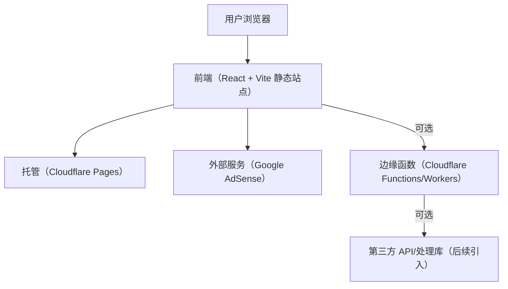

## 1. 架构设计
产品以静态站点为主，优先保证访问速度与部署简单；对确实需要后端算力/文件处理的能力，使用 Cloudflare Pages Functions/Workers 作为可选扩展层。

## 2. 技术选型说明
- 前端：React@18 + TypeScript + Vite + tailwindcss
- 路由：react-router-dom（工具页与文章页使用稳定 URL）
- 状态：zustand（仅用于全站偏好/工具历史等轻量状态）
- 图表：优先用轻量 SVG/Canvas 自绘；必要时再引入图表库
- 后端：MVP 不启用；二期按需使用 Cloudflare Pages Functions/Workers
- 数据：MVP 使用本地 JSON/静态数据（工具清单、文章元数据）；二期可接 KV/D1

## 3. 路由定义
| 路由 | 用途 |
|---|---|
| / | 首页 |
| /tools | 工具列表（分类/搜索） |
| /tools/mortgage | 房贷计算器 |
| /tools/loan | 贷款计算器 |
| /tools/compound-interest | 复利计算器 |
| /tools/word-chain | 单词接龙 |
| /tools/word-generator | 单词生成器 |
| /guides | 文章/专题列表 |
| /guides/:slug | 文章详情（SEO 内容页） |
| /about | 关于/隐私/免责声明 |

## 4. API 定义（可选扩展）
MVP 无 API。二期如加入文件转换/图片处理，建议使用边缘函数形式，按工具粒度拆分。

示例（占位）：
- POST /api/convert（输入：源格式、目标格式、文件；输出：转换后的文件）
- POST /api/image/process（输入：图片、操作参数；输出：处理后的图片）

## 5. SEO 与性能策略（工程层面）
- 语义化结构：每个工具页包含清晰标题、说明、FAQ 区块
- 结构化数据：为工具页与 FAQ 输出 JSON-LD（SoftwareApplication/FAQPage）
- 站内链接：工具页互链、文章页导向工具页，减少“孤岛页面”
- Sitemap/robots：构建时生成 sitemap.xml 与 robots.txt
- 性能：尽量零后端、零阻塞请求；图片与静态资源使用 Cloudflare 缓存

## 6. 广告接入方案（AdSense）
- 形态：响应式广告位（工具页顶部/结果下方/侧栏）
- 技术：在页面 head 注入 AdSense 脚本；用组件化方式控制广告位渲染与占位高度，避免布局抖动
- 合规：提供隐私政策与广告说明页面；避免在核心操作区域强插广告影响可用性

## 7. 部署方案（GitHub + Cloudflare Pages）
- 源码托管：GitHub 仓库
- 自动构建：Cloudflare Pages 连接 GitHub，push 即触发构建
- 构建命令：npm run build
- 输出目录：dist
- 环境变量：如后续启用 Functions/第三方 API，再通过 Cloudflare 配置

## 8. 里程碑拆分
- 里程碑 A（MVP）：首页/工具列表/5 个工具页/基础 SEO/基础广告位占位/Cloudflare Pages 上线
- 里程碑 B（增长）：文章页体系、程序化内容生产流程、更多长尾工具扩展
- 里程碑 C（能力扩展）：引入边缘函数做文件转换/图片处理（优先合法、可解释的处理项）
